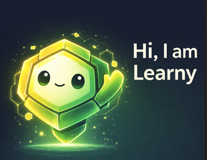

# Learny

Learny is the official Filecoin learning companion for LearnFIL.

Built for Discord, Learny reinforces key concepts, delivers daily micro quizzes, and rewards mastery through achievement badges.

Learny is learning first. Always.

<p align="center">
  
</p>

---

## Purpose

LearnFIL provides structured, in browser Filecoin education.

Learny extends that experience into Discord by:

* Reinforcing core concepts
* Encouraging consistent learning
* Rewarding knowledge progression
* Keeping discussions grounded in understanding

Learny is not a trading bot.
Learny does not chase hype.
Learny exists to strengthen mastery of the Filecoin ecosystem.

---

## Core Features

### Concept Explainer

Quick explanations aligned with LearnFIL modules.

Examples:

* `/cid`
* `/storage-deal`
* `/fvm`
* `/porep`

Responses are short, precise, and technically accurate.

---

### Daily Micro Quiz

One Filecoin question per day.

* Multiple choice format
* Immediate explanation after answer
* No penalties for mistakes
* Designed for retention, not pressure

Correct answers accumulate over time.

---

### Achievement Badges

Badges are awarded based on total correct answers.

* 5 correct answers → CID Explorer
* 15 correct answers → Storage Strategist
* 30 correct answers → FVM Builder

When unlocked:

* Learny assigns a Discord role
* A calm public announcement is posted
* The learner’s progression becomes visible

Badges represent mastery milestones, not competition.

---

### Progress Tracking

Users can check their progress:

`/progress`

Displays:

* Total correct answers
* Current badge tier
* Next milestone

Optional leaderboard:

`/leaderboard`

Command only.
Not automatically broadcast.
Focused on learning engagement, not rank dominance.

---

## Design Principles

Learny follows strict principles:

* Learning over competition
* Signal over noise
* Filecoin focused
* Encouraging, not pressuring
* Clear and concise explanations

No hype.
No spam.
No public shaming.

---

## Architecture

* Node.js
* TypeScript
* discord.js
* Scheduled quiz jobs
* Lightweight score tracking

Designed to be simple, extensible, and aligned with the LearnFIL ecosystem.

---

## Repository Structure

```
learny/
  src/
    commands/
    quizzes/
    services/
    events/
    index.ts
  public/
    learny-avatar.png
  .env.example
  package.json
  README.md
```

---

## Vision

LearnFIL teaches you.
Learny reinforces you.

Together they create a structured, social, and sustainable way to master Filecoin.
